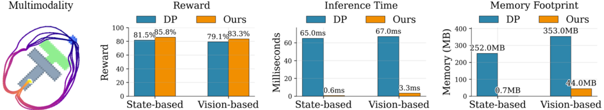
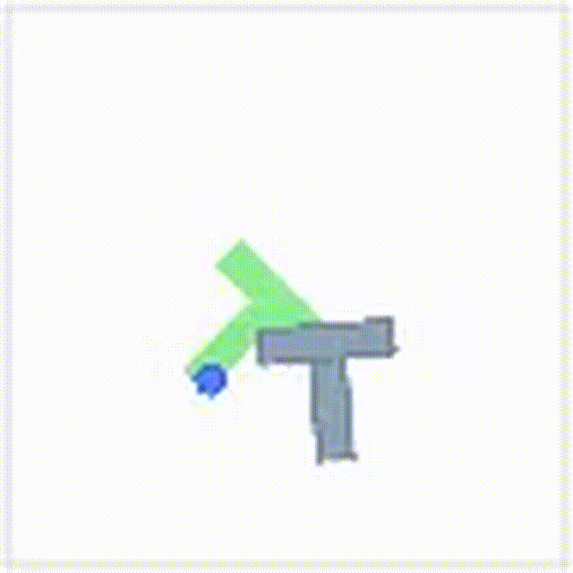
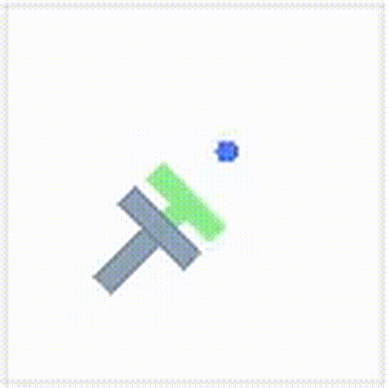

# Geometry-Aware Policy Imitation (GPI) 

[📄 Paper](https://arxiv.org/abs/2510.08787) | [🌐 Project Page](https://yimingli1998.github.io/projects/GPI/) | [💻 Code](https://github.com/yimingli1998/GPI) |  [📚 BibTeX](#bibtex)

**Geometry-aware imitation**: GPI treats demonstrations as geometric curves, inducing distance and flow fields that make imitation **simple**, **efficient**, **flexible**, and **interpretable**.

 GPI delivers multimodal behaviors with **higher success rates** and inference speeds that are **20–100× faster** than diffusion policies, while **slashing memory by orders of magnitude**.


<table>
  <tr>
    <td align="center">
      
    </td>
    <td align="center">
      
    </td>
    <td align="center">
      
    </td>
    <td align="center">
      
    </td>
  </tr>
</table>

## Repository Layout

```
gpi/          GPI database, planner, and policy abstractions
pusht/        PushT datasets, environments, download helpers, evaluation utils
scripts/      Entry points for training, policy rollouts, and evaluation
models/       Default location for datasets and checkpoints (auto-populated)
results/      Logs and rollout videos produced by evaluation scripts
environment.yml Python dependencies 
```

## Installation

Create and activate the recommended conda environment:

```bash
conda env create -f environment.yml
conda activate gpi
```
## Quick Start

Run the pretrained state-based policy:

```bash
python scripts/run_state_policy.py --seed 500 --max-steps 200
```

Run the pretrained vision policy:

```bash
python scripts/run_vision_policy.py --seed 500 --max-steps 200
```

Both scripts include extensive CLI options; append `--help` to inspect defaults and descriptions:

- `--k-neighbors`: number of demonstrations blended per query.
- `--action-horizon`: trajectory horizon fetched from the database.
- `--subset-size`: random subset size for approximate nearest neighbours.
- `--batch-size`: PyTorch batch size for scoring.
- `--device`: override automatic `cuda`/`cpu` selection.
- `--obs-noise-std`, `--noise-decay`, `--min-noise-std`, `--disable-noise`: latent exploration controls.
- `--random-seed`: random seed for sampling and policy noise.
- `--memory-length`: cap the loop-avoidance buffer.
- `--fixed-lambda1`, `--fixed-lambda2`: manually weight progression vs attraction flows.
- `--action-smoothing`: exponential smoothing factor for actions.
- `--no-relative-action`: operate in absolute action space.
- `--video-path`, `--no-save-video`: manually set or disable rollout video export.
- `--no-live-render`: disable the interactive window for headless runs.
- `--quiet`: silence tqdm progress output.


## Evaluation

Automate sweeps across random seeds or parameter grids using:

```bash
python scripts/run_state_evaluation.py --count 20 --max-steps 200
python scripts/run_vision_evaluation.py --count 20 --max-steps 200
```

Key flags:

- `--dataset`: input PushT replay archive (auto-downloaded if missing).
- `--checkpoint`: ResNet18 vision checkpoint path (vision evaluation only).
- `--count`: number of runs to generate.
- `--random-seed`: deterministic configuration sampling.
- `--video-dir` / `--no-save-video`: control mp4 exports (defaults to `results/`).

Each evaluation logs `Reward`, `Inference Time`, and `Memory` to stdout and `results/logs/`.

## Training the Vision Encoder

Finetune the ResNet18 state predictor to refresh the vision policy backbone:

```bash
conda activate gpi
python scripts/train_vision_features.py \
  --dataset models/pusht_cchi_v7_replay.zarr.zip \
  --output-dataset models/pusht_cchi_v7_replay_imgs_feature_epoch_200.zarr \
  --checkpoint-path models/vision_state_predictor_epoch_200.ckpt
```

The training script attaches a lightweight task-specific head that regresses object pose directly from each image frame. During inference we reuse this predicted pose for distance computation, so the vision policy queries the same geometry-aware metric as the state-based planner. However, other visual encoders for latent embeddings can also be used, such as VAEs or pretrained models.


Datasets and checkpoints are auto-downloaded to `models/` when absent. Adjust the output names to avoid overwriting existing artifacts.

## Troubleshooting

- **Dependency mismatch**: Version conflicts among `pygame`, `pymunk`, `zarr`, or `gym` can break the simulator. Verify the environment was created from `environment.yml`.
- **Missing assets**: If downloads fail, clear the partial files in `models/` and re-run the command; the script retries automatically.
- **Headless rendering**: Use `--no-live-render` to avoid opening a window on remote servers. Videos will still be written to `results/`.

## BibTeX
<a id="bibtex"></a>

```bibtex
@misc{GPI,
Author = {Yiming Li and Nael Darwiche and Amirreza Razmjoo and Sichao Liu and Yilun Du and Auke Ijspeert and Sylvain Calinon},
Title = {Geometry-aware Policy Imitation},
Year = {2025},
Eprint = {arXiv:2510.08787},
}
```

<!-- ## Citation

If you use this codebase, please cite the Geometry-Aware Policy Imitation paper included as `GEOMETRY_AWARE_POLICY_IMITATION.pdf`.

## License

MIT License — provided for research and educational use without warranty. -->
